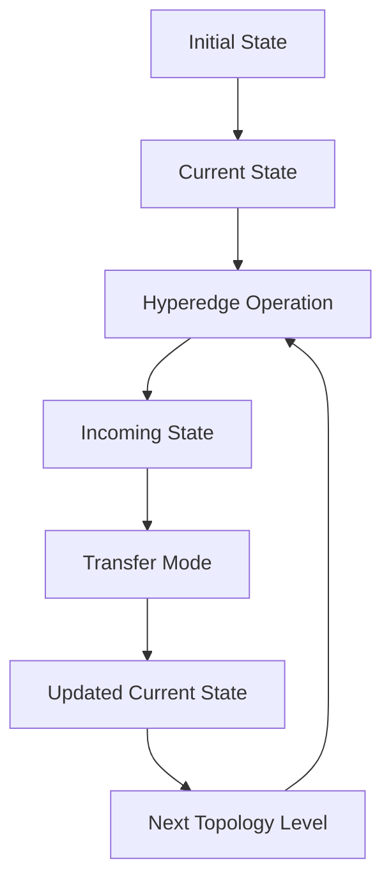

# MHD Project

> **Multi-Hypergraph Dynamic Project**
> A unified deep-learning framework that models neural computation as a dynamic multi-hypergraph composed of feature-map/state nodes, computational hyperedges, and explicit execution topology.

[](https://www.python.org/)
[](https://pytorch.org/)
[](LICENSE)
[](https://github.com/souray0410/MHD_Project)
[](https://github.com/souray0410/MHD_Project/releases/latest)

---

# 中文

## 1. 项目简介

**MHD Project（Multi-Hypergraph Dynamic Project，多超图动态项目）** 是一个持续演化的深度学习计算框架，核心思想是将神经网络中的**特征图与中间表示建模为节点（Node）**，将**卷积、变换、融合以及其他计算操作建模为超边（Hyperedge）**，并通过显式的**拓扑结构（Topology）**组织整个计算过程。

与传统的顺序式神经网络不同，MHD 不将网络仅仅描述为：

```text
Input → Layer → Layer → Layer → Output
```

而是将神经计算抽象为：

```text
                 Hyperedge
              ┌─────────────┐
              │ Computation │
              └──────┬──────┘
                     ↓
Node A ──────────── Node C
   │                   ↑
   └──── Hyperedge ────┘
            ↑
          Node B
```

在这一抽象下：

* **Node** 表示特征图、状态或中间表示；
* **Hyperedge** 表示作用于一个或多个节点的计算操作；
* **Topology** 描述节点与超边之间的连接关系、参数顺序以及执行顺序；
* **State Transition** 描述节点状态在计算过程中的更新与传播。

V1、V2 和 V3 并不是三个互相独立的项目，而是同一套 MHD 核心思想逐步演化的三个阶段。

> **当前核心版本：V3**
> V1 和 V2 保留作为 MHD 的历史演化与架构基础，后续开发以 V3 为主要框架。

---

## 2. 核心思想

### 2.1 节点：Feature Map / State

在 MHD 中，一个节点不仅仅是一个 tensor 容器，它代表网络计算中的一个**状态单元**。

V3 中，一个 `MHD_Node` 具有：

* `initial_state`：初始状态；
* `current_state`：当前计算状态；
* `transfer_mode`：状态融合/转移方式。

因此，一个节点可以经历：

```text
Initial State
      ↓
Current State
      ↓
Hyperedge Computation
      ↓
Incoming State
      ↓
Transfer Mode
      ↓
Updated Current State
```

V3 当前支持的状态融合模式包括：

```text
replace
sum
avg
max
min
mul
```

这种设计使节点从传统神经网络中的“静态 feature tensor”进一步演化为具有明确生命周期的**状态节点**。

---

### 2.2 超边：Computation

MHD 中的计算操作由 `MHD_Edge` 表示。

一个超边可以连接多个输入节点和多个输出节点：

```text
Node A ─┐
        │
Node B ─┼──→ Hyperedge E ──→ Node C
        │                 └──→ Node D
Node E ─┘
```

因此，超边并不局限于传统意义上的单输入单输出层。

超边内部可以组合：

* `torch.nn.Module`
* callable function
* `functools.partial`
* 字符串形式的 tensor operation

因此，卷积、归一化、激活、池化、融合以及其他张量变换都可以被抽象为超边内部的计算过程。

---

### 2.3 拓扑：Execution Structure

MHD 将网络的**结构**与具体的**计算操作**进行分离。

Topology 负责描述：

* 哪些节点参与某个超边；
* 节点在超边中的输入/输出角色；
* 输入和输出参数的顺序；
* 超边的执行顺序；
* 不同计算 level 之间的依赖关系。

在 V2 中，这主要通过：

```text
role_matrix
sort_matrix
```

实现。

其中：

```text
-1 → input / head
 0 → inactive
+1 → output / tail
```

V3 则进一步扩展为：

```text
role_matrices = [
    level 0,
    level 1,
    ...
]

sort_matrices = [
    level 0,
    level 1,
    ...
]
```

因此，V3 的拓扑不再只是一个静态二维连接关系，而可以描述**多层级的动态执行结构**。

---

## 3. 状态驱动的计算模型

MHD 的一个核心设计方向，是将网络计算从简单的 feed-forward tensor transformation 扩展为**state-aware computation**。

从抽象层面来看：



这里的核心不是把 MHD 简单定义为传统意义上的有限状态机，而是通过明确的**状态转移机制（state transition mechanism）**使图中的节点具有动态计算状态。

这使得网络计算可以从：

```text
Layer 1 → Layer 2 → Layer 3
```

扩展为：

```text
State
  ↓
Topology
  ↓
Hyperedge
  ↓
State Update
  ↓
Next Level
  ↓
...
```

---

# 4. MHD 的版本演化

MHD Project 的 V1、V2、V3 是同一核心思想的持续演化。

---

## V1 — Node-Oriented Architecture

V1 建立了 MHD 最早期的核心思想：

> **Feature Map → Node**
> **Computation / Connection → Hyperedge-like structure**

V1 的实际核心代码并不位于当前 `V1/` 目录中，而主要保存在项目根目录下：

```text
node_toolkit/
node_pipline/
```

其中：

### `node_toolkit/`

主要承担网络、数据和结果相关的底层组件。

例如：

```text
node_net.py
node_dataset.py
node_results.py
node_utils.py
```

其中 `node_net.py` 进一步定义了：

* `DNet`
* `HDNet`
* `MHDNet`

形成了从动态卷积模块到超边网络，再到多子图网络的早期架构。

### `node_pipline/`

主要承担实验和训练流程，例如：

```text
node_train.py
train_UniConnNetI.py
train_UniConnNetII.py
train_UniConnNetIII.py
test_UniConnNetI.py
test_UniConnNetII.py
test_UniConnNetIII.py
```

因此，V1 的核心贡献并不是一个固定模型，而是建立了：

```text
Node
  ↓
Hyperedge-based computation
  ↓
Graph-like neural architecture
```

这一基础范式。

---

# 5. V2 — Formalized Hypergraph Framework

V2 将 V1 中已经存在的 Node / Hyperedge 思想进一步形式化为一个独立的 MHD Framework。

V2 的核心组件为：

```text
MHD_Node
MHD_Edge
MHD_Topo
MHD_Graph
```

并通过：

```text
role_matrix
sort_matrix
```

明确表达：

* 节点与超边之间的连接关系；
* 输入/输出角色；
* 参数传递顺序；
* 拓扑执行顺序。

与此同时，V2 引入了更加明确的：

```text
initial_state
current_state
```

设计，使节点状态不再完全依赖外部 forward 过程中的临时 tensor。

V2 因此完成了一个重要转变：

> **从“Node-based neural network implementation”走向“general hypergraph computational framework”。**

V2 代码位于：

```text
V2/
└── mhd_toolkit/
    ├── MHD_Framework_V2.py
    ├── MHD_Utils_V2.py
    └── MHD_Example_V2.py
```

---

# 6. V3 — Multi-Level Dynamic Hypergraph Framework

**V3 是当前 MHD Project 的核心版本。**

V3 保留了 V1/V2 的核心抽象：

```text
Node
Edge
Topology
Graph
```

同时进一步扩展了：

* 多层级拓扑；
* 显式状态转移；
* 动态节点状态；
* 多种状态融合模式；
* 更灵活的 hyperedge operation；
* graph composition / graph merging。

---

## 6.1 Multi-Level Topology

V3 最大的结构性升级之一，是将单一拓扑扩展为多 level topology：

```text
Level 0
    ↓
Hyperedges
    ↓
Updated Node States
    ↓
Level 1
    ↓
Hyperedges
    ↓
Updated Node States
    ↓
Level 2
    ↓
...
```

对应实现：

```python
role_matrices
sort_matrices
```

每一个 level 都拥有自己的 role / sort matrix。

V3 可以针对不同 level 独立执行拓扑排序和 edge dependency analysis，使网络结构能够表达更加复杂的分层计算过程。

---

## 6.2 Stateful Nodes

V3 的 `MHD_Node` 使用双状态机制：

```text
initial_state
current_state
```

节点可以：

* reset 到初始状态；
* 更新初始输入；
* 在 forward 中持续更新 current state；
* 根据 `transfer_mode` 融合新的输入状态。

这使得 node 从单纯的 feature container 演化为真正参与计算过程的**state-bearing computational unit**。

---

## 6.3 Flexible Hyperedge Operations

V3 的 `MHD_Edge` 支持一个 edge 内包含多个操作：

```python
edge_operations = [
    operation_1,
    operation_2,
    operation_3,
]
```

操作可以是：

```text
nn.Module
callable
partial
string tensor operation
```

因此一个 hyperedge 可以代表：

```text
Convolution
   ↓
Normalization
   ↓
Activation
   ↓
Pooling
```

或者更复杂的多输入、多输出计算。

---

## 6.4 Graph Composition

V3 进一步支持多个 MHD graphs 的组合。

`merge_graph()` 能够处理：

* node 对齐；
* edge 对齐；
* topology 对齐；
* multi-level topology padding；
* node state 合并。

因此多个独立构建的 MHD subgraphs 可以进一步组合成更大的计算图。

这一能力为模块化网络设计以及复杂架构组合提供了基础。

---

# 7. Unified MHD Abstraction

从 V1 到 V3，MHD 的核心抽象可以统一表示为：

```text
                    MHD Graph
                       │
          ┌────────────┴────────────┐
          │                         │
        Nodes                    Hyperedges
          │                         │
     Feature / State           Computation
          │                         │
          └────────────┬────────────┘
                       │
                    Topology
                       │
               Execution Order
                       │
                State Transition
                       │
                 Next Level
```

因此：

| MHD Concept   | Neural Network Interpretation       |
| ------------- | ----------------------------------- |
| Node          | Feature Map / State                 |
| Hyperedge     | Computational Operation             |
| Topology      | Connectivity + Execution Order      |
| Current State | Dynamic Intermediate Representation |
| Transfer Mode | State Fusion / Transition           |
| Graph         | Complete Computational Structure    |
| Level         | Structured Execution Stage          |

---

# 8. Project Structure

当前项目整体结构如下：

```text
MHD_Project/
│
├── README.md
├── LICENSE
│
├── V1/
│   └── ...
│
├── node_toolkit/
│   ├── node_dataset.py
│   ├── node_net.py
│   ├── node_results.py
│   ├── node_utils.py
│   ├── reorgan.py
│   └── split_Tr.py
│
├── node_pipline/
│   ├── node_train.py
│   ├── train_UniConnNetI.py
│   ├── train_UniConnNetII.py
│   ├── train_UniConnNetIII.py
│   ├── test_UniConnNetI.py
│   ├── test_UniConnNetII.py
│   ├── test_UniConnNetIII.py
│   └── MICCAI2026/
│
├── V2/
│   ├── NULL
│   └── mhd_toolkit/
│       ├── MHD_Framework_V2.py
│       ├── MHD_Utils_V2.py
│       └── MHD_Example_V2.py
│
├── V3/
│   └── mhd_toolkit/
│       ├── MHD_Framework_V3.py
│       └── MHD_Utils_V3.py
│
├── contrast_model/
│   ├── train_*.py
│   └── test_*.py
│
├── performance/
│   ├── binary.py
│   └── restore_npy.py
│
└── tools/
    ├── print_folder.py
    ├── save_delete.py
    └── script_sequence.py
```

### V1 Structure

The original V1 implementation is primarily represented by:

```text
node_toolkit/
node_pipline/
```

The `V1/` directory is retained as a version marker and historical placeholder.

### V2 Structure

```text
V2/
└── mhd_toolkit/
```

contains the first explicitly formalized MHD framework.

### V3 Structure

```text
V3/
└── mhd_toolkit/
```

contains the current core implementation.

---

# 9. Current V3 Framework

The current V3 core consists of:

```text
MHD_Framework_V3.py
MHD_Utils_V3.py
```

### `MHD_Framework_V3.py`

Provides the core computational abstractions:

```text
MHD_Node
MHD_Edge
MHD_Topo
MHD_Graph
```

### `MHD_Utils_V3.py`

Provides supporting utilities for:

* dataset handling;
* augmentation;
* training;
* validation;
* inference;
* monitoring;
* checkpointing;
* optimizer creation.

---

# 10. Installation

## Requirements

Recommended environment:

* Python 3.8+
* PyTorch 1.10+
* CUDA-capable GPU recommended for large 3D medical-imaging experiments

Common dependencies include:

```text
numpy
pandas
scipy
scikit-learn
nibabel
opencv-python
tabulate
tqdm
```

Because the repository contains multiple historical versions and experimental pipelines, dependencies may vary between versions.

For reproducible experiments, use the dependency configuration associated with the target version/release.

---

# 11. Installation and Setup

## Clone the Repository

```bash
git clone https://github.com/souray0410/MHD_Project.git
cd MHD_Project
```

## Install Dependencies

```bash
pip install -r requirements.txt
```

> If a dedicated `requirements.txt` is provided in a release, use the release-specific dependency file for reproducibility.

---

# 12. Download the Latest Release

The current development focus is **V3**.

For stable or reproducible usage, please use a tagged release instead of relying exclusively on the latest state of the `main` branch.

### Latest Release

[https://github.com/souray0410/MHD_Project/releases/latest](https://github.com/souray0410/MHD_Project/releases/latest)

### All Releases

[https://github.com/souray0410/MHD_Project/releases](https://github.com/souray0410/MHD_Project/releases)

---

# 13. Usage

## V1

The V1-era experiments are mainly organized through:

```text
node_pipline/
node_toolkit/
```

Typical entry points include training scripts such as:

```bash
python node_pipline/node_train.py
```

and the UniConnNet experiment scripts under:

```text
node_pipline/
```

---

## V2

V2 examples are provided under:

```text
V2/mhd_toolkit/MHD_Example_V2.py
```

and the framework can be imported from:

```python
from V2.mhd_toolkit.MHD_Framework_V2 import (
    MHD_Node,
    MHD_Edge,
    MHD_Topo,
    MHD_Graph,
)
```

---

## V3

For new research and development, use:

```text
V3/mhd_toolkit/
```

The main framework can be imported as:

```python
from V3.mhd_toolkit.MHD_Framework_V3 import (
    MHD_Node,
    MHD_Edge,
    MHD_Topo,
    MHD_Graph,
)
```

A minimal conceptual workflow is:

```python
node = MHD_Node(
    id=0,
    name="input",
    initial_state=input_tensor,
)

edge = MHD_Edge(
    id=0,
    name="operation",
    edge_operations=[
        ...
    ],
)

topo = MHD_Topo(
    role_matrices=[
        role_matrix_level_0,
        role_matrix_level_1,
    ],
    sort_matrices=[
        sort_matrix_level_0,
        sort_matrix_level_1,
    ],
)

graph = MHD_Graph(
    nodes={node},
    edges={edge},
    topos={topo},
)

graph.forward()
```

The exact topology and operation configuration depends on the target architecture.

---

# 14. Visualization

MHD graphs can be represented through Mermaid-based graph descriptions.

Example:

```python
mermaid_code = graph.generate_mermaid()
print(mermaid_code)
```

This allows the computational structure to be inspected independently from the implementation details of the underlying operations.

---

# 15. Application Direction

The original MHD framework was developed around complex medical-imaging tasks, including segmentation-oriented experiments.

The broader MHD abstraction, however, is not limited to a single model family.

Because nodes represent feature/state units and hyperedges represent computational transformations, the framework is intended to provide a more general representation for:

* multi-branch neural networks;
* encoder–decoder architectures;
* feature fusion;
* skip connections;
* multi-stage computation;
* state-aware networks;
* modular computational graphs.

---

# 16. Why V3?

V3 is currently recommended because it combines the architectural ideas developed throughout V1 and V2 into a more explicit dynamic framework.

Compared with earlier versions, V3 provides:

* **multi-level topology;**
* **explicit initial/current node states;**
* **state transfer modes;**
* **flexible hyperedge operation sequences;**
* **level-wise topological execution;**
* **graph composition and merging;**
* **a clearer separation between structure, computation, and state.**

The goal of V3 is therefore not simply to provide another neural-network implementation, but to establish a more general computational abstraction in which:

```text
Nodes      → represent states
Hyperedges → represent computation
Topology   → represents execution structure
Graph      → represents the complete dynamic system
```

---

# 17. Development Roadmap

Future development may include:

* stronger formalization of multi-hypergraph semantics;
* richer state-transition mechanisms;
* more expressive hyperedge composition;
* improved graph serialization and reconstruction;
* configuration-driven architecture generation;
* reproducible benchmark suites;
* stronger visualization and graph analysis;
* improved packaging and release management;
* broader applications beyond the original medical-imaging setting.

---

# 18. Contributing

Contributions, issues, and discussions are welcome.

```bash
git checkout -b feature/your-feature
git add .
git commit -m "Add your feature"
git push origin feature/your-feature
```

Then open a Pull Request on GitHub.

For substantial architectural changes, please describe:

1. the motivation;
2. the affected abstraction;
3. compatibility with previous versions;
4. any changes to topology/state semantics;
5. experimental or benchmark results where applicable.

---

# 19. License

This project is licensed under the MIT License.

See [LICENSE](LICENSE) for details.

---

# 20. Author

**Souray Meng**

GitHub: [https://github.com/souray0410](https://github.com/souray0410)

---

# English

## 1. Overview

**MHD Project (Multi-Hypergraph Dynamic Project)** is an evolving deep-learning framework that models neural computation as a **dynamic multi-hypergraph**.

The central abstraction is:

* **Nodes** represent feature maps, hidden representations, or computational states.
* **Hyperedges** represent convolution, transformation, fusion, and other computational operations.
* **Topology** explicitly defines connectivity, execution order, and multi-level dependencies.
* **State transitions** describe how node states are updated as computation proceeds.

Instead of representing a network only as a sequential chain,

```text
Input → Layer → Layer → Layer → Output
```

MHD represents computation as a structured dynamic graph:

```text
Node
  ↓
Hyperedge
  ↓
Node State Update
  ↓
Next Topology Level
```

V1, V2, and V3 are successive implementations of the same underlying MHD concept.

> **V3 is the current core implementation and the recommended starting point for new development.**

---

## 2. Core Architecture

### Nodes

A node represents a feature map or computational state.

V3 explicitly distinguishes:

```text
initial_state
current_state
```

and provides multiple state-transfer modes:

```text
replace
sum
avg
max
min
mul
```

This allows nodes to participate in explicit state transitions during graph execution.

### Hyperedges

A hyperedge represents a computational transformation involving one or multiple nodes.

An `MHD_Edge` may contain:

* PyTorch modules;
* Python callables;
* partial functions;
* string-based tensor operations.

Therefore, operations such as convolution, normalization, activation, aggregation, projection, and fusion can be represented as hyperedge computations.

### Topology

The topology explicitly specifies:

* node roles;
* edge-node connectivity;
* argument ordering;
* execution dependencies;
* multi-level execution stages.

V2 uses:

```text
role_matrix
sort_matrix
```

while V3 generalizes these to:

```text
role_matrices
sort_matrices
```

with one pair of matrices per execution level.

---

# 3. Evolution: V1 → V2 → V3

## V1 — Node-Oriented Architecture

V1 established the original node-based design.

The primary implementation is preserved in:

```text
node_toolkit/
node_pipline/
```

rather than inside the current `V1/` directory.

The V1 framework introduced:

* dynamic convolutional computation through `DNet`;
* hyperedge-oriented processing through `HDNet`;
* multi-subgraph organization through `MHDNet`;
* explicit node and connection structures;
* dedicated training and experiment pipelines.

The key conceptual transition was:

```text
Feature Map → Node
Computation → Hyperedge-like operation
Network → Structured node-based computation
```

---

## V2 — Formal Hypergraph Framework

V2 formalized the architecture into:

```text
MHD_Node
MHD_Edge
MHD_Topo
MHD_Graph
```

and introduced explicit topology matrices:

```text
role_matrix
sort_matrix
```

V2 also formalized node state management with:

```text
initial_state
current_state
```

and separated the framework from experiment-specific network definitions.

V2 therefore transformed the original implementation into a more general hypergraph computational framework.

---

## V3 — Multi-Level Dynamic Hypergraph Framework

V3 is the current core.

It preserves the abstraction developed in V1 and V2 while extending it with:

* multi-level topology;
* explicit node state transitions;
* state-transfer modes;
* flexible edge operation sequences;
* level-wise topological execution;
* graph merging and composition.

The central V3 abstraction is:

```text
MHD_Node
      +
MHD_Edge
      +
MHD_Topo
      ↓
MHD_Graph
```

with state evolution across topology levels.

---

# 4. V3 Multi-Level Execution

V3 represents topology as multiple execution levels:

```text
Level 0
   ↓
Hyperedge Computation
   ↓
Node State Update
   ↓
Level 1
   ↓
Hyperedge Computation
   ↓
Node State Update
   ↓
...
```

This enables the framework to represent computational structures that are not naturally described as a single static sequential graph.

Each level may define its own:

```text
role_matrix
sort_matrix
```

allowing independent dependency analysis and topological scheduling.

---

# 5. Project Structure

```text
MHD_Project/
│
├── README.md
├── LICENSE
│
├── V1/
│   └── ...
│
├── node_toolkit/
│   ├── node_dataset.py
│   ├── node_net.py
│   ├── node_results.py
│   ├── node_utils.py
│   ├── reorgan.py
│   └── split_Tr.py
│
├── node_pipline/
│   ├── node_train.py
│   ├── train_UniConnNetI.py
│   ├── train_UniConnNetII.py
│   ├── train_UniConnNetIII.py
│   ├── test_UniConnNetI.py
│   ├── test_UniConnNetII.py
│   ├── test_UniConnNetIII.py
│   └── MICCAI2026/
│
├── V2/
│   ├── NULL
│   └── mhd_toolkit/
│       ├── MHD_Framework_V2.py
│       ├── MHD_Utils_V2.py
│       └── MHD_Example_V2.py
│
├── V3/
│   └── mhd_toolkit/
│       ├── MHD_Framework_V3.py
│       └── MHD_Utils_V3.py
│
├── contrast_model/
├── performance/
└── tools/
```

---

# 6. Installation

```bash
git clone https://github.com/souray0410/MHD_Project.git
cd MHD_Project
pip install -r requirements.txt
```

Recommended environment:

```text
Python 3.8+
PyTorch 1.10+
CUDA recommended for large-scale experiments
```

---

# 7. Latest Release

For stable and reproducible usage, please use the latest tagged release:

**Latest Release:**
[https://github.com/souray0410/MHD_Project/releases/latest](https://github.com/souray0410/MHD_Project/releases/latest)

**All Releases:**
[https://github.com/souray0410/MHD_Project/releases](https://github.com/souray0410/MHD_Project/releases)

New development is primarily focused on **V3**.

---

# 8. V3 Quick Start

```python
from V3.mhd_toolkit.MHD_Framework_V3 import (
    MHD_Node,
    MHD_Edge,
    MHD_Topo,
    MHD_Graph,
)
```

A graph is constructed from:

```text
Nodes
Edges
Topology
```

and executed through:

```python
graph.forward()
```

The resulting computation is governed by the explicit topology and node state transitions.

---

# 9. Design Principles

MHD is built around four principles:

### Explicit Structure

Network connectivity should be represented explicitly.

### Computation–Structure Separation

The topology defines **where and when** computation occurs, while hyperedges define **what computation** is performed.

### State-Aware Execution

Nodes maintain computational states and participate in explicit state transitions.

### Composability

MHD graphs are designed to be modular and composable, allowing complex architectures to be assembled from smaller computational subgraphs.

---

# 10. Current Status

**V3 is the current core framework and the recommended foundation for future development.**

V1 and V2 remain in the repository as historical and architectural milestones.

The overall evolution can be summarized as:

```text
V1
Node-oriented neural architecture
        ↓
V2
Formal hypergraph computational framework
        ↓
V3
Multi-level, state-aware dynamic hypergraph framework
```

---

# 11. Roadmap

Potential future directions include:

* formal mathematical characterization of the MHD abstraction;
* richer state-transition semantics;
* more expressive hyperedge operators;
* graph serialization and reconstruction;
* automated graph generation;
* configuration-based architecture definition;
* systematic benchmarks;
* advanced graph visualization;
* broader applications beyond medical imaging.

---

# 12. Contributing

Contributions and discussions are welcome.

```bash
git checkout -b feature/your-feature
git add .
git commit -m "Add your feature"
git push origin feature/your-feature
```

Then open a Pull Request.

---

# 13. License

MIT License.

See [LICENSE](LICENSE) for details.

---

# 14. Author

**Souray Meng**

GitHub: [https://github.com/souray0410](https://github.com/souray0410)
